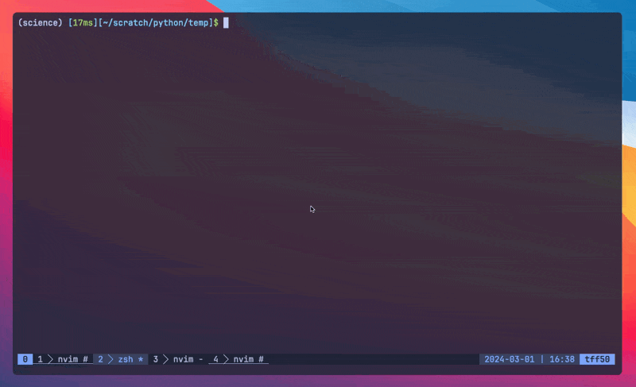

# run.nvim

<<<<<<< HEAD
An extremely simple plugin for running code without leaving neovim.

## Requirements

- neovim nightly (tested with `v0.10.0-dev-2488+g5d4e1693c`)

## Installation

The default configuration is shown below.

```lua
-- lazy
{
    "wakelin-g/run.nvim",
    event = "VeryLazy",
    config = function()
        require("run").setup()
    end,
}
```

## Configuration

You can configure `run.nvim` by passing a table to `require("run").setup()` in your lazy plugin table. The following are the default options (if you don't need to change these, you can just leave `require("run").setup()` empty):

````lua
...
config = function()
    require("run").setup({
        use_default_bindings = true,
        output_msg = " -- OUTPUT -- ",
        win_width = 40,
        commands = {
            ["c"] = "clang " .. vim.fn.expand("%") .. " && ./a.out",
            ["cpp"] = "clang++ " .. vim.fn.expand("%") .. " && ./a.out",
            ["python"] = "python " .. vim.fn.expand("%"),
            ["rust"] = "cargo run",
            ["go"] = "go run " .. vim.fn.expand("%"),
            ["lua"] = "lua " .. vim.fn.expand("%"),
            -- add custom commands here! ex:
            -- ["sh"] = "bash " .. vim.fn.expand("%")
        },
    })
end,
...

- `use_default_bindings` (bool) : if true, maps `<C-b>` (control + b) `:Run`, which executes the filetype-specific command. **Note**: If you set this to false, you can instead bind the run command to a key of your choice as follows:

```lua
    vim.keymap.set("n", "<YOUR-KEY-HERE", "<cmd>Run<CR>", { silent = true, noremap = true })
```

- `output_msg` (string) : message displayed at the top of the run window.

- `win_width` (integer) : width of opened window (in character cells).

- `commands` (table) : table of commands in `["<filetype>"] = "<command>"` format, where `"<command>"` denotes the command that will be executed when `:Run` is called from a buffer with detected filetype of `["<filetype>"]`.
  - If you are unsure of how neovim perceives your filetype of interest, enter a buffer of this filetype and execute `:lua print(vim.filetype.match({ buf = vim.api.nvim_get_current_buf() }))`.

## Usage

If you use the default configuration, or pass `use_default_bindings = true` to the setup function, you can use `<C-b>` to execute a filetype-specific predesignated code segment and display the results in a window opened to the right of your current buffer. Each time you save your file, the code segment will be automatically re-executed.



`run.nvim` registers a custom filetype for the opened window called `runwin`. This conveniently allows you to close the opened buffer using `q` rather than `:q` by associating an autocmd and keymap with `runwin`.
````
